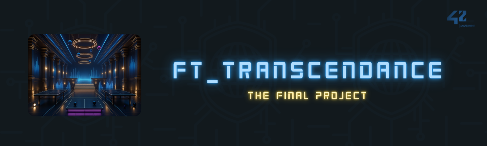

<br>
<br>

<p style="font-size:1.5em; font-style:italic; font-weight:bold; text-align:center">Welcome to ft_transcendence, a multiplayer pong game built for the last project of 42 school curriculum. This project demonstrates full-stack development skills with a focus on real-time gameplay, cybersecurity, and modern web technologies.</p>

<br>

## Table of Contents

- [Project Overview](#project-overview)
- [Setup](#setup)
- [Mandatory Features](#mandatory-features)
	- [Technical Requirements](#technical-requirements)
	- [Game Mechanics](#game-mechanics)
	- [Security](#security)
- [Added Modules](#added-modules)
- [Achievements](#achievements)
- [Collaborators](#collaborators)
- [How to Contribute](#how-to-contribute)
- [License](#license)

<br>

## Project Overview

The **ft_transcendence** project is about creating a website for the mighty Pong contest! Users will play Pong with others through a nice user interface and real-time multiplayer online games.

### Key Features

- **Real-Time Multiplayer Pong**: Users can participate in live Pong games against other players directly on the website, using the same keyboard.
- **Tournament System**: Organize tournaments with multiple players, displaying matchups and player order.
- **Registration System**: Players input their alias names at the start of a tournament, which resets for new tournaments.
- **Matchmaking**: The tournament system organizes matchmaking and announces the next match.
- **Uniform Game Rules**: All players, including AI, adhere to the same rules, such as identical paddle speed.
- **Secure Gameplay**: Passwords are hashed, and the website is protected against SQL injections and XSS. HTTPS is mandatory for all connections.
- **Form Validation**: Comprehensive validation for all user inputs and forms.


<br>

## Setup

### 1. Define environment variables

Set up the environment variables by defining them in the `.env_example` file located at the project root, then rename it to `.env`.

### 2. Generate SSL Certificates for Local HTTPS

Create a self-signed SSL certificate to enable HTTPS locally:
```bash
openssl req -x509 -nodes -newkey rsa:2048 -keyout ./nginx/ssl/private.key -out ./nginx/ssl/server.crt -days 365 -subj "/C=US/ST=State/L=City/O=Organization/OU=Unit/CN=localhost"
```

### 3. Run the Project

Build and launch the project using Docker Compose:
```bash
docker-compose up --build
```

### 4. Access the Application

Once the project is running, access the application at:
```
https://localhost:4242 // for localhost
https://${hostname}:4242 // for remote server, hostname can be changed in the env variable HOST_NAME
```

### 5. Enjoy the Game!

<br>

## Mandatory Features

#### Technical Requirements

- **Backend**: Managed by a custom Web module ✅
- **Database**: Managed by the Web module ✅
- **Frontend**: Vanilla JavaScript, supplemented by a frontend toolkit ✅
- **Single Page Application (SPA)**: Implemented ✅
- **Browser Compatibility (Chrome)**: Fully supported ✅
- **No console errors/warnings**: No unhandled issues ✅
- **Single Command Launch**: Everything runs with one command ✅

#### Game Mechanics

- **2 Players on Same Keyboard**: Local multiplayer support ✅
- **Local Tournament**: Flexible tournament management system ✅
- **Username in Tournament**: Displayed during matches ✅
- **Matchmaking**: Organizes rounds and announces matchups ✅
- **Game Rules**: Standard pong rules (paddle size, ball speed, etc.) enforced ✅

#### Security

- **Hashed Passwords**: All passwords stored in the database are securely hashed ✅
- **Protection Against XSS/SQL Injection**: Implemented ✅
- **HTTPS & WSS**: Full SSL support for HTTP and WebSocket connections ✅
- **Form Validation**: Comprehensive input validation for all forms ✅

<br>

## Added Modules

#### Web

- **Backend Framework**: Major module integrating a backend framework ✅
- **Frontend Toolkit**: Minor module using a modern frontend toolkit ✅
- **Database Integration**: Minor module for database-backed operations ✅

#### User Management

- **Standard User Management**: Complete user authentication and management system ✅

#### Gameplay

- **Remote Players**: Support for remote multiplayer games ✅
- **Live Chat**: Integrated real-time chat during gameplay ✅

#### AI/Algorithms

- **User and Game Statistics Dashboards**: Minor module showing detailed game statistics ✅

#### Cybersecurity

- **WAF/ModSecurity + HashiCorp Vault**: Major module for web application firewall and secret management ✅

#### Accessibility

- **Expanded Browser Compatibility**: Minor module ensuring compatibility across multiple browsers ✅
- **Support on All Devices**: Minor module adding responsive support across devices ✅

#### Server-Side Pong

- **Server-Side Game Logic**: Major module with server-side control over game mechanics ✅

<br>

## Achievements

<div align="center" style="display: flex; justify-content: center; align-items: center; padding:50px">
	<table width="100%" style="font-size:1.2em; border: 1px solid; border-collapse: collapse; margin-right: 20px;">
		<tr>
			<td width="70%" style="border: 1px solid;">Major modules</td>
			<td width="30%" style="border: 1px solid;">6</td>
		</tr>
		<tr>
			<td width="70%" style="border: 1px solid;">Minor modules</td>
			<td width="30%" style="border: 1px solid;">5</td>
		</tr>
		<tr>
			<td width="70%" style="border: 1px solid;">Potential Grade</td>
			<td width="30%" style="border: 1px solid;">115</td>
		</tr>
	</table>
	<div>
		
	</div>
</div>


## Collaborators

<br>

<table width="80%" align="center">
	<tr>
		<td align="center">
			<a href="https://github.com/ChrstphrChevalier">
				
				<br>Christopher
			</a>
			<br>
			<a href="https://profile.intra.42.fr/users/waziz">42 Intra Profile</a>
		</td>
		<td align="center">
			<a href="https://github.com/esrch">
				
				<br>Eric
			</a>
			<br>
			<a href="https://profile.intra.42.fr/users/erabbath">42 Intra Profile</a>
		</td>
		<td align="center">
			<a href="https://github.com/aceyzz">
				
				<br>Cedric
			</a>
			<br>
			<a href="https://profile.intra.42.fr/users/cedmulle">42 Intra Profile</a>
		</td>
	</tr>
</table>

<br>

## How to Contribute

If you'd like to contribute to this project, feel free to fork the repository, make your changes, and submit a pull request. We welcome contributions related to gameplay enhancements, security improvements, and general code refactoring.

<br>

## License

This project is licensed under the [MIT License](./LICENSE). See the `LICENSE` file for more details.
